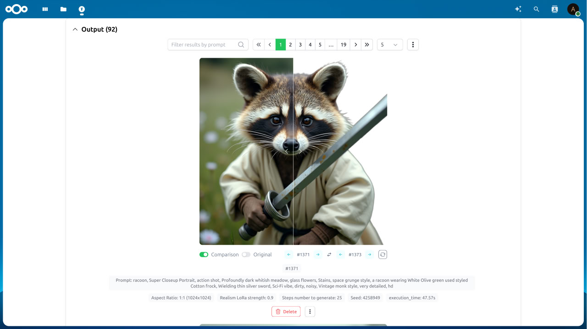
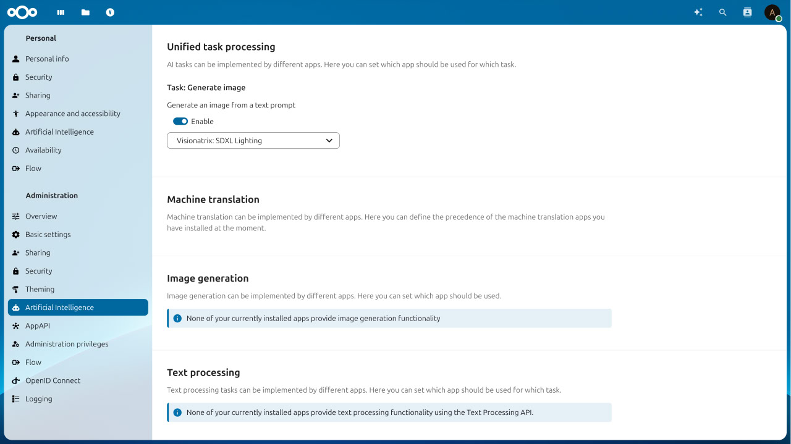

# Nextcloud Visionatrix Integration

Introducing scalable AI media processing for Nextcloud.

<picture>
  <source media="(prefers-color-scheme: dark)" srcset="./screenshots/visionatrix_1_dark.jpg">
  
</picture>

<picture>
  <source media="(prefers-color-scheme: dark)" srcset="./screenshots/visionatrix_2_dark.jpg">
  
</picture>

This is a standalone [Visionatrix](https://github.com/Visionatrix/Visionatrix) service, allowing you to process media files directly within your Nextcloud.

Each user is authenticated via Nextcloud credentials and has a personal task history.

> [!NOTE]
> We recommend starting with the "light-weight" flows, such as SDXL Lighting, Remove background (BiRefNet), and Remove background (Bria), to test your hardware.

## TextToImage Provider

You can use Visionatrix as the TextToImage provider via [Nextcloud Assistant](https://github.com/nextcloud/assistant).

Once the Visionatrix flow is installed and supported, it will be registered as a TextToImage provider.

> [!NOTE]
> Not all Visionatrix flows are available in Nextcloud Assistant. See the list [here](https://github.com/cloud-py-api/visionatrix/blob/main/ex_app/lib/supported_flows.py)

<picture>
  <source media="(prefers-color-scheme: dark)" srcset="./screenshots/visionatrix_3_dark.jpg">
  
</picture>

<picture>
  <source media="(prefers-color-scheme: dark)" srcset="./screenshots/visionatrix_4_dark.jpg">
  
</picture>

## Installation

> [!NOTE]
> The `AppAPI` application needs to be enabled to install and use this application.

### Installation

1. Configure [AppAPI](https://github.com/nextcloud/app_api).
2. Once AppAPI is set up and the deployment daemon is configured, install the Nextcloud Visionatrix.
3. Enjoy Nextcloud Visionatrix from the Top Menu.

We offer two types of installation:

1. **Standard Installation**: Includes both the Visionatrix server for task management and a built-in worker for task processing.

	> For this installation, you'll need either a powerful CPU with at least 32 GB of RAM or a GPU with at least 8 GB of VRAM.
	> _(Some flows, like background removal, are fast even on CPU and don’t require high-end hardware.)_

2. **Advanced Installation**: Starting from Nextcloud version `31`, you can install only the server component by setting `DISABLE_WORKER=1` in the environment variables during application installation. In this mode, the server will manage tasks, while external workers (installed elsewhere) will process them.

> [!NOTE]
> Worker authentication uses Nextcloud credentials. If 2FA is enabled, you will need to use an App Password to connect external workers.

For more information, please refer to the original [Visionatrix documentation](https://visionatrix.github.io/VixFlowsDocs/).

## Freeing GPU Memory After Execution

By default, models remain resident in GPU memory after each task. To control this behavior, we’ve added two options on the **Settings → Workers** page:

1. **Smart Memory** (enable/disable)
2. **Cache Type** (select caching strategy)

If you need GPU memory to be released after task execution, we recommend:

1. **For systems with > 64 GB RAM**
   Disable **Smart Memory**. This will offload GPU memory to your system RAM, freeing up VRAM.

2. **For systems with ≤ 64 GB RAM**
   a. Disable **Smart Memory**.
   b. Set **Cache Type** to **None**.

## Questions

Feel free to ask questions or report issues.
