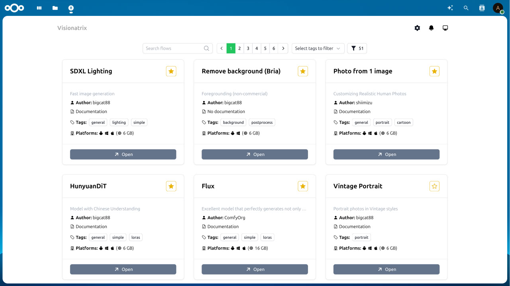

# Nextcloud Visionatrix integration

Introduce the scalable AI Media processing for Nextcloud.

<picture>
  <source media="(prefers-color-scheme: dark)" srcset="./screenshots/visionatrix_1_dark.jpg">
  
</picture>

<picture>
  <source media="(prefers-color-scheme: dark)" srcset="./screenshots/visionatrix_2_dark.jpg">
  
</picture>

Nextcloud Visionatrix is a standalone [Visionatrix](https://github.com/Visionatrix/Visionatrix) service that allows you to process your media files right in your Nextcloud.

Each user authenticated using Nextcloud credentials and has their own tasks history.

## TextToImage provider

You can use Visionatrix as the TextToImage provider via [Nextcloud Assistant](https://github.com/nextcloud/assistant).
As soon as you have Visionatrix flow installed, and it's supported, it will be registered as a TextToImage provider.

> [!NOTE]
> Not all Visionatrix flows are available in Nextcloud Assistant, see list [here](https://github.com/cloud-py-api/visionatrix/blob/main/ex_app/lib/supported_flows.py)

<picture>
  <source media="(prefers-color-scheme: dark)" srcset="./screenshots/visionatrix_3_dark.jpg">
  
</picture>

<picture>
  <source media="(prefers-color-scheme: dark)" srcset="./screenshots/visionatrix_4_dark.jpg">
  
</picture>

## Installation

1. Install and configure [AppAPI](https://github.com/cloud-py-api/app_api)
2. After AppAPI is installed and Deploy daemon is configured, install Nextcloud Visionatrix ExApp from the Nextcloud AppStore.
3. Enjoy Nextcloud Visionatrix from the Top Menu.

> [!NOTE]
> The Deploy daemon with GPU 12GB+ VRAM is recommended to run all available Visionatrix flows.
>
> If environment variable in the AppAPI deploy daemon contains `DISABLE_WORKER=1` than only Server part of Visionatrix 
> will run, and it does not require GPU at all, 
> but requires Visionatrix workers to run where it suits you that will process tasks connecting to the server version.

## Workers Configuration

By default, Visionatrix uses available hardware on daemon as the first worker.
It **supports scalability** by attaching additional workers (remote).
You can even setup your home computer with GPU as a worker for your Nextcloud.

> [!NOTE]
> Worker Auth have to use Nextcloud credentials. If you 2FA is enabled, you have to use App Password.

For more information on that, please refer to the [Visionatrix documentation](https://visionatrix.github.io/VixFlowsDocs/).

## Questions

Do not hesitate to ask any questions or report issues.

### We are looking for maintainers for this ExApp (we will help), as we only have time for Visionatrix itself.
